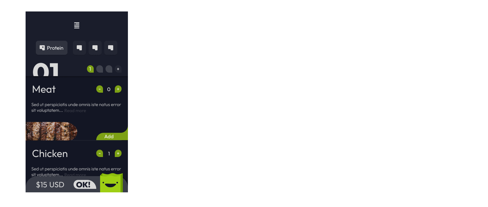
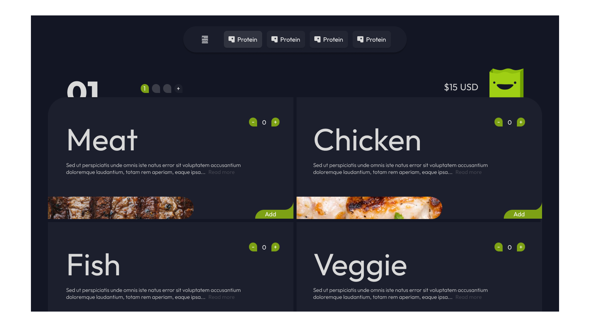

# Sandwich Delivery
[EN - README](https://github.com/linaurena/restaurante-linaurena#readme)

 

Hola, esta es una [demo](https://restaurant-linaurena.netlify.app/) para simular un website donde puedes ordenar un sandwich personalizado. Espero que te brinde una buena experiencia de usuario. Si quieres darme tu opinión, te lo agradeceré.

Ahora, te explicaré algunas cosas.

 

## Contents

* [Interfaz de usuario](#interfaz-de-usuario)
* [Brief y requerimientos del proyecto](#brief-y-requerimientos-del-proyecto)
* [Dependencias en este proyecto](#dependencias-en-este-proyecto)
* [Estructura del proyecto](#estructura-del-proyecto)
* [Pruébalo tu mismo](#pruebalo-tu-mismo)
* [Lo que aprendí](#lo-que-aprendi)

 

---

 

## Interfaz de usuario

Antes que nada, quiero decirte que me encanta hacer interfaces de usuario. Por esta razón, te comparto un prototipo que hice para este proyecto. La idea principal de este proyecto es hacer pedidos de sándwich uno por uno con diferentes opciones de ingredientes.

 

---

 

## Brief y requerimientos del proyecto

 

### Brief
* Un usuario debe poder ingresar, navegar por los productos e ir a sus detalles.
* Desde el detalle se debe poder ver la descripción, foto y precio e ingresarlo al carrito.
* Una vez que el carrito tenga al menos un producto, se deberá visualizar un listado compacto de la orden con el precio total.
* Al ingresar su nombre, apellido, teléfono e e-mail (ingresándolo dos veces para corroborar que sea correcto), debe activarse el botón de ‘realizar compra’.
* Al clickear ‘realizar compra’ debe guardarse en la base de datos una orden que tenga todos los productos, la fecha y dar feedback del número de orden.

 

---
 

## Dependencias en este proyecto

### Sass

En mi opinion [esta](https://sass-lang.com/install) es una herramienta muy útil para escribir estilos. Para este proyecto utilicé la [metodología BEM](https://en.bem.info/methodology/quick-start/):

*Algo como esto:*

`className="bloque__elemento--modificador"`

... entonces, puedes ver menos código CSS que en un archivo CSS estándar. Además, ayuda a que el código sea más legible y mantenible.

 

### React router dom

Un requisito esencial para este proyecto fue el enrutamiento, con este paquete es posible dar rutas a una SPA (Single Page Application) y mostrar una URL que hace una solicitud al servidor con información dinámica o estática.

*Ejemplos:*

~~~
<Route index path='/' element={<Home />} />

<NavLink to="/static">...<NavLink />

<Link to="/">... <Link/>

<Link to="/static/:id">...<Link />

<Link to={`/static/${id}`}>...<Link /> 

// The last one with { useParams}
~~~

 

---

 

## Estructura del proyecto

~~~
app
|__./public/
|  |__ favicon.ico
|  |__ index.html
|  |
|__./src/
|  |__ components
|  |  |__ NavBar
|  |  |  |__ Brand
|  |  |  |__ CartWidget
|  |  |  |__ Categories
|  |  |  |__ NavBar
|  |  |  |__ OrderWidget
|  |  |  
|  |  |__ sections (Pages)
|  |     |__ Cart
|  |     |__ Error404
|  |     |__ ItemDetailContainer
|  |     |__ItemListContainer
|  |
|  |__ helpers
|  |  |__ getFetch.js
|  |
|  |__ img
|  |  |__ documentation
|  |  |__ icons
|  |  |__ products
|  |
|  |__ App.js
|  |__ index.js
|  |__ index.scss
|
|__ README.md
|__ README-ES.md

~~~
---

 

## Pruébalo tu mismo

Clic [aquí](https://restaurant-linaurena.netlify.app/) para ver la demo.

 

---

 

## Lo que aprendí

Comentaré esto próximamente.