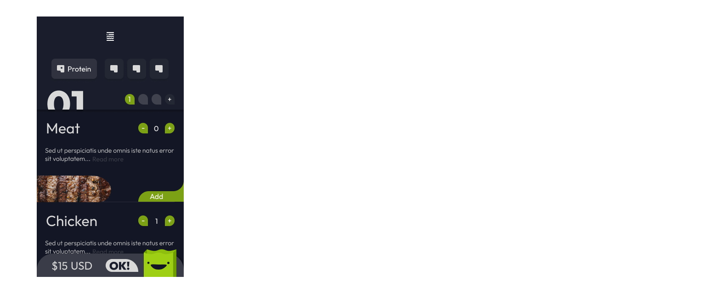
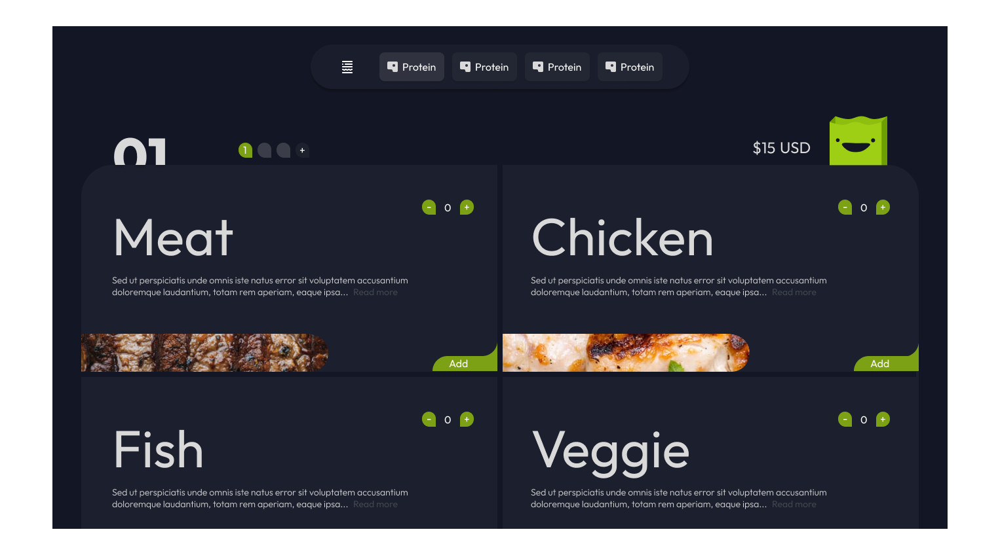

# Sandwich Delivery
[SPA - README](https://github.com/linaurena/restaurante-linaurena/blob/main/README-ES.md)

 

Hi, this is a [demo](https://restaurant-linaurena.netlify.app/) to simulate a website where you can order a personalized sandwich. I hope it brings you a nice user experience, If you want to give me feedback I'll be grateful to you.

Now, I'll explain to you some things.

 

## Contents

* [User Interface](#user-interface)
* [Brief & project requirements](#brief-&-project-requirements)
* [Dependencies in this project](#dependencies-in-this-project)
* [Project structure](#project-structure)
* [Test it yourself](#try-it-yourself)
* [What I learned](#what-i-learned)

 

---

 

## User Interface

First of all, I want to tell you that I love to do user interfaces. For this reason, I am sharing with you a prototype that I made for this project. The main idea of this project is to do sandwich orders one by one with different choices of ingredients.

 

---

 

## Brief & project requirements

 

### Brief
* The user can enter, navigate to products and details.
* From the detail, you should be able to see the description, photo, and price and enter it into the cart.
* Once the cart has at least one product, a compact list of the order with the total price should be displayed.
* When entering your name, surname, telephone, and e-mail (entering it twice to verify that it is correct), the 'make a purchase' button must be activated.
* When clicking on 'make a purchase' the order must be saved in the database that has all the products, and the date and give feedback on the order number.

 

---
 

## Dependencies in this project

### Sass

In my opinion, [this](https://sass-lang.com/install)  is a very useful tool for writing styles. For this project I used the [BEM methodology](https://en.bem.info/methodology/quick-start/):

*Like this:*

`className="block__element--modifier"`

... so, you can see less CSS code than a vanilla CSS file. Also, it helps you make the code more readable and maintainable.

 

### React router dom

An essential requirement for this project was the routing, with this package it is possible to give routes to a SPA (Single Page Application) and display a URL that makes a request to the server with dynamic or static information.

*Examples:*

~~~
<Route index path='/' element={<Home />} />

<NavLink to="/static">...<NavLink />

<Link to="/">... <Link/>

<Link to="/static/:id">...<Link />

<Link to={`/static/${id}`}>...<Link /> 

// The last one with { useParams}
~~~

 

---

 

## Project structure

~~~
app
|__./public/
|  |__ favicon.ico
|  |__ index.html
|  |
|__./src/
|  |__ components
|  |  |__ NavBar
|  |  |  |__ Brand
|  |  |  |__ CartWidget
|  |  |  |__ Categories
|  |  |  |__ NavBar
|  |  |  |__ OrderWidget
|  |  |  
|  |  |__ sections (Pages)
|  |     |__ Cart
|  |     |__ Error404
|  |     |__ ItemDetailContainer
|  |     |__ItemListContainer
|  |
|  |__ helpers
|  |  |__ getFetch.js
|  |
|  |__ img
|  |  |__ documentation
|  |  |__ icons
|  |  |__ products
|  |
|  |__ App.js
|  |__ index.js
|  |__ index.scss
|
|__ README.md
|__ README-ES.md

~~~
---

 

## Test it yourself

Click [here](https://restaurant-linaurena.netlify.app/) to watch the demo.

 

---

 

## What I learned

I'll comment on this proximately.